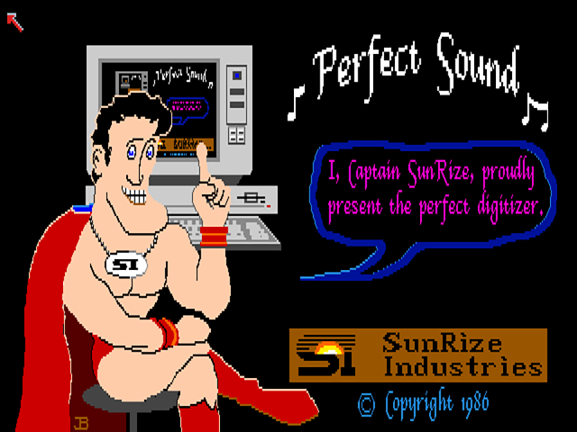
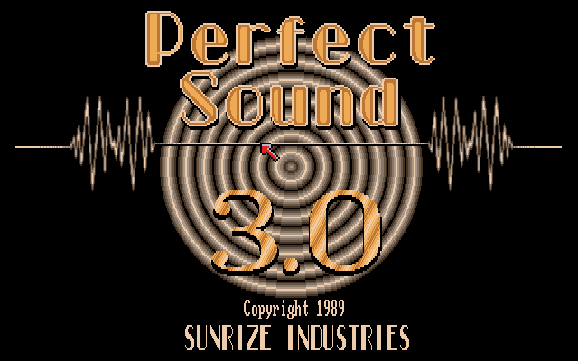
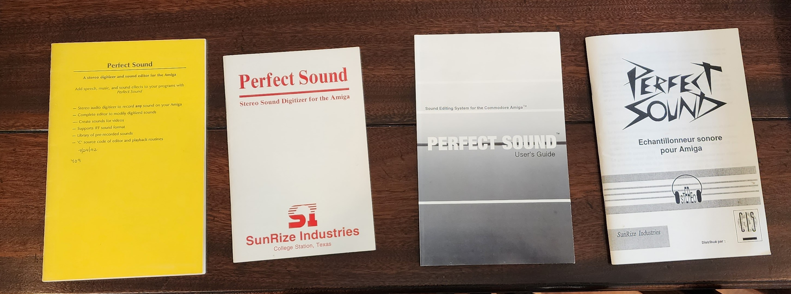
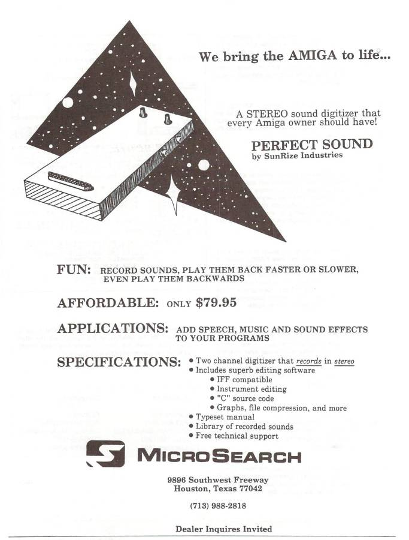

# Perfect Sound
This folder contains the source code, orcad schematic, amiga disk images (for use in an emulator), and pictures of the Perfect Sound 8-bit digitizer hardware and software.

Perfect Sound was a stereo 8-bit sound sampler (also known as a sound digitizer) for the Commodore Amiga Computer.  The Amiga was the first computer that could play stereo 8 bit audio, but there was no way to record it.  Perfect Sound let you record and edit audio files.

Perfect Sound was a top selling third party product for the Amiga in the USA.  It was sold from 1986 until about 1994 (when the Commodore company went out of business.)  People mainly used Perfect Sound for fun (it was a novelty to record and edit audio back then),  as well as to create musical "instrument" files, and to record sound effects for software.  One of may favorite first uses was to play audio backwards and find the hidden messages in Beatels records.   

Perfect Sound was my first commercially successful product.  I created it for my [recently purchased Amiga Computer](./../../aw-microcomputer-history.md).  In the year 1986 according to this [message to my friend college friend Bobby Deen.](./source/ps-1-src/readme). To sell Perfect Sound I started SunRize Industries while in College in 1986 (the summer between my junior and senior years) when I was 20.

  

## Hardware
### Schematic (Electrical Design)
There were two primary versions of the Electrical Design -- the original which had two "pots" for input gain, and a version developed later that had digital input gain and added a microphone input.   Although I thought the digital gain was cool, looking back on it, it was not an improvements.  The physical pots were easier to use, and the newer design used a single Analog-to-Digital converter where as the prior design used two, which allowed for faster sampling rates.

#### Second Generation with digital input gain and microphone input

### Case
One of the hardest things to do on a very small budget and with no experience was to develop the case that enclosed the PCB (Printed Circuit Board).  Originally I actually hand assembled cases out of hobbyist plastic and epoxy!  Then when I had a little more money (from selling the epoxy build Perfect Sounds) I discovered that a machine shop could make metal cases.  Then I switched to a better machine shop in Caldwell, TX  ("precision").  The owner explained i could paint the cases!  Then later I found a company in Taiwan that would make plastic injection molded cases, all done via the mail.

 

### Software
There were many versions of the software, but the two primary ones were version 2.3 and 3.x.  I wrote the software, and my friend John Bruner, designed the opening title screens using Deluxe Paint.  When you launched Perfect sound it would play the message I recorded "Welcome to Perfect Sound" at several different sample rates, and then play my friend John saying "press the left mouse button to continue".

#### Version 2.3

#### Version 3.0

 

  
 

### Packaging
The packaging also evolved from two colors versions that was designed by our original distributor "MicroSearch" in Houston, and then eventually to a four-color=process that SunRize Industries designed (third party designer, i think his name was Louis) and distributed ourselves.

 

## MicroSearch
In the early days of SunRize, I struck a deal with Microsearch to distribute Perfect Sound.  As sales increased and we had more cash, I took back distribution in house.

